# Milkah Michira

### Full-Stack Developer · Data · Systems Engineering

**Nairobi, Kenya 💜**

Building systems that survive real-world pivots.

I’m a full-stack developer focused on building **resilient backend systems, real-time applications, and data-driven solutions** for retail and fintech use cases.

My project work includes IBM simulation sprints involving serverless architecture, workflow orchestration, data engineering, real-time synchronisation, and AI-powered customer support.

**[GitHub](https://github.com/TheRealMilkah)** · Nairobi, Kenya

---

## 🎌 Featured Builds

| Project                                                                                     | What I Built                                                                                                                                                                                                                                                                | Stack                              |
| :------------------------------------------------------------------------------------------ | :-------------------------------------------------------------------------------------------------------------------------------------------------------------------------------------------------------------------------------------------------------------------------- | :--------------------------------- |
| **[meridian-pivot-serverless](https://github.com/TheRealMilkah/meridian-pivot-serverless)** | Inventory synchronisation service built during an IBM mid-sprint architecture pivot. Replaced a polling-only approach with both **Vercel Cron polling and webhook ingestion**, using Upstash Redis for persistence across serverless invocations. **🏆 100% Perfect Score** | `Vercel` `Node.js` `Upstash Redis` |
| **[solstice-kiosk](https://github.com/TheRealMilkah/solstice-kiosk)**                       | Async badge-printing kiosk rebuilt after a vendor API change. Uses **durable Temporal workflows, webhook signals, duplicate protection, and asynchronous processing**.                                                                                                      | `TypeScript` `Fastify` `Temporal`  |
| **[GROUP36](https://github.com/TheRealMilkah/GROUP36)**                                     | Northstar support-deflection MVP. Worked on the **data engineering layer**, validating and structuring an offline JSON dataset covering Order, Return, and Stock support intents.                                                                                           | `Python` `JSON` `Data Validation`  |
| **[reflex-delivery-sync](https://github.com/TheRealMilkah/reflex-delivery-sync)**           | Real-time delivery coordination system designed for retailers managing operations across WhatsApp. Synchronises activity between **retailers, dispatchers, and riders**.                                                                                                    | `Firebase RTDB` `Tailwind CSS`     |
| **[FinAssistFrontend](https://github.com/TheRealMilkah/FinAssistFrontend)**                 | AI-powered payment support system for fintech customer-service workflows. Built across the **frontend and backend**, including payment lookup, customer verification, support cases, issue reporting, and dispute flows.                                                    | `React` `Vite` `Python` `FastAPI`  |

---

## 📊 Sprint Results

| Project              | Area                         |   Score   |
| :------------------- | :--------------------------- | :-------: |
| **Meridian Pivot**   | Serverless Architecture      |  **100%** |
| **Northstar Sprint** | Data Engineering & Packaging | **93.1%** |

---

## 🛠️ Technologies

**Languages**

`TypeScript` `JavaScript` `Python`

**Backend & Infrastructure**

`Node.js` `FastAPI` `Fastify` `Vercel Functions` `Temporal` `Upstash Redis`

**Frontend**

`React` `Vite` `Tailwind CSS`

**Data & Real-Time Systems**

`Firebase Realtime Database` `JSON` `Data Validation`

---

## 🔧 What I Build

* Full-stack web applications
* Resilient backend systems
* Serverless APIs and event-driven architectures
* Real-time synchronisation
* Durable asynchronous workflows
* Data validation and structured datasets
* AI-assisted customer support systems
* Fintech and retail technology

I’m particularly interested in systems that have to **adapt when requirements, vendors, or architecture change mid-build**.

---

## 🌃 Contribution City

*Every commit builds a tower. Rebuilt daily.*

<picture>
  <source media="(prefers-color-scheme: light)" srcset="https://raw.githubusercontent.com/TheRealMilkah/TheRealMilkah/output/github-contribution-grid-snake.svg">
  
</picture>

---

### Always learning. Always building. 💜

`TheRealMilkah`
